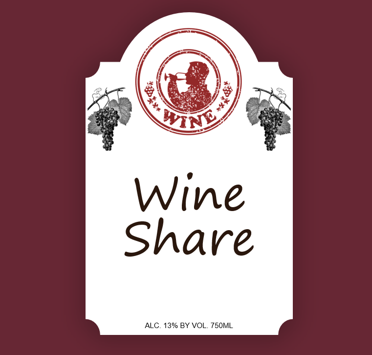
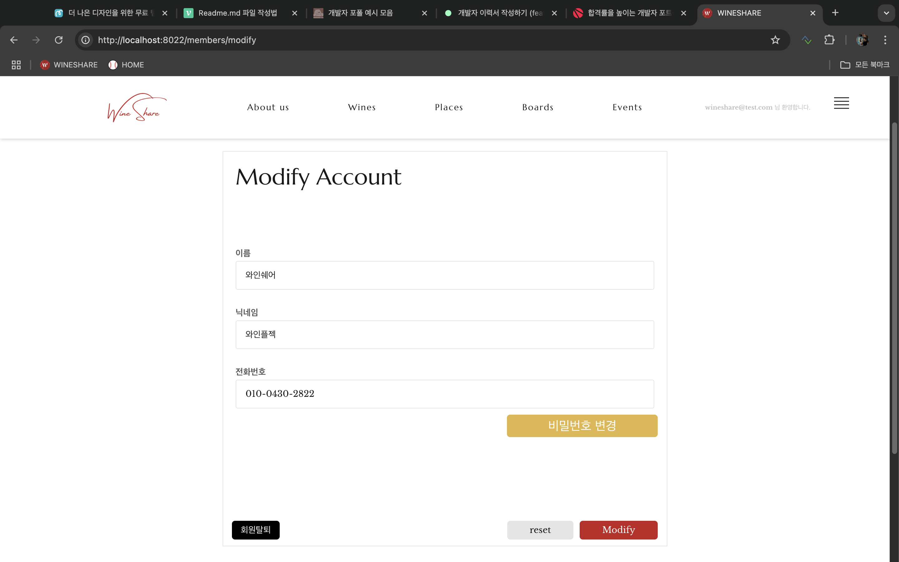

### 목차

> 1. [프로젝트 소개](#프로젝트-소개)
> 2. [IA 정보구조도](#IA-정보구조도)
> 3. [ERD 엔티티 관계도](#ERD-엔티티-관계도)
> 4. [기술 스택](#기술-스택)
> 5. [주요 기능](#주요-기능)
> 6. [주요 화면](#주요-화면)
> 7. [API 명세](#API-명세)
> 8. [향후 개선 사항](#향후-개선-사항)

# 프로젝트 소개

>  
> ### 와인을 공유하다, WINESHARE 와인 정보 제공 및 커뮤니티 플랫폼
>
> 전문가(소믈리에)들이 작성해주는 와인 정보와 공공 API를 연동하여 다양한 와인 정보를 수집, 가공하여 사용자 맞춤형 조회 서비스를 제공합니다.  
> 
> 사용자는 원하는 와인 정보를 검색, 필터링하고, 관심있는 와인을 셀러로 등록하여 해당 와인들만 정리해서 볼 수 있습니다.   
> 
> 등업 게시판을 통해 일반 사용자에서 전문가로 권한변경을 요청하고, 변경 할 수 있으며, 요청 게시판을 통해 사이트에는 없는 와인에 대한 정보를 요청할 수 있고, 다양한 질문이 가능한 질문 게시판이 있습니다. 
> 위 게시판들을 통해 사용자 간 의견을 공유하고, 와인에 대한 다양한 관점을 나눌 수 있는 플랫폼을 구축하고 이로써 사용자 친화적이고 기능적으로도 완성도 높은 와인 정보 서비스를 제공합니다.
> 
> 전문가들의 매장을 등록하고 프로모션을 등록할 수 있으며, 홍보를 해줌으로써 전문가들의 정보 제공에 동기를 부여했습니다.
> 
> 사용자가 와인을 친근하게 접근할 수 있도록 이벤트를 통해 와인 시음회나 행사들을 볼 수 있습니다.
> 
> SpringBoot 프레임워크를 사용하여 MVC 패턴의 기본적인 CRUD를 구현하고
> AJAX를 통해 REST API를 설계하여 사용자 중심의 HTTP 비동기 처리를 구현하였습니다.
>
> **REFERENCE** [vivino](https://www.vivino.com/?srsltid=AfmBOop0pTFXpypezAvVIzxOK1vsAX_5B4i0vicOy4SdaIEqw35XJ6xR) 
> **REFERENCE** [와인나라](https://www.winenara.com/)

> ### 개발 기간
> 2024.10.01 ~ 2024.10.28

> ### 개발 인원(4명)
> **이종진(FULLSTACK)**   
> 기획, 설계, 개발환경 구축, GIT 관리   
> 로그인, 회원가입, 사이트 소개, 공지·등업·질문·요청 게시판, 플레이스, 이벤트, 사용자 마이페이지(회원정보관리), 관리자 대시보드 구현
>
> **오은우(FULLSTACK)**   
> 기획, 설계, API 연동, GIT 관리   
> 메인, 와인 목록, 와인 상세, 사용자 마이페이지(셀러), 관리자 대시보드 구현
>
> **최수림(FRONTEND)**   
> ppt, 모든 뷰에 대한 마크업, css
> 
> **오재환(FRONTEND)** 
> 자료조사

# IA 정보구조도
> </img> 

# ERD 엔티티 관계도
</img> 

# 기술 스택
</img> 

# 주요 기능
### 요약
| 공통                                                    | 일반 사용자                                          | 전문가                                  | 관리자                                             |
|-------------------------------------------------------|-------------------------------------------------|--------------------------------------|-------------------------------------------------|
| -회원가입, 로그인 -와인 목록 조회 -게시글 목록 조회 -플레이스&이벤트 조회 | -와인 셀러 추가 -와인 리뷰 작성 -게시글, 댓글 작성 -마이페이지 | -와인 정보 등록 및 수정 -플레이스&프로모션 등록 및 수정 | -와인 데이터 관리 -회원 관리 -게시글 관리 -플레이스&이벤트 관리 |

## [공통 기능]
### 회원가입, 로그인
* 아이디, 비밀번호 유효성 검증과 비밀번호 암호화를 설정했다.
### 메인
* 별점순, 인기순, 최신순 와인 조회가 가능하다.
* 기본으로 3개씩 보여지며 더보기를 누르면 해당 조건으로 필터링해서 와인 목록으로 보내준다.
* 최신 등록된 플레이스(전문가들의 업장) 조회가 가능하다.
* 기본으로 3개씩 보여지며 슬라이드로 2번 더 옆으로 넘길 수 있고 해당 플레이스를 누르면 전문가가 등록했을 때 작성한 링크로 보내진다.
### 와인 목록
* 와인 종류에 따른 조회가 가능하다.
* 와인 이름이나 와인 생산국으로 검색 조회가 가능하다.
* 인기순, 최신순, 가격 높·낮은순, 별점 높·낮은순, 가격 범위로 정렬이 가능하며 한 페이지에 4*3개의 공연 목록이 나타난다.
### 와인 상세
* 와인의 세부정보와 와인의 아로마, 와인과 어울리는 음식을 조회할 수 있다.
* 해당 와인과 비슷한 와인으로 같은 종류의 와인, 아로마가 비슷한 와인, 어울리는 음식이 비슷한 와인, 같은 생산국의 와인이 1개씩 보여지며 누르면 해당 와인의 상세로 넘어간다.
* 와인 리뷰와 전문가의 별점, 일반 사용자의 별점 조회가 가능하다.
* 전문가의 경우 리뷰를 작성하면서 해당 와인의 정보 추가·수정이 가능하다.
### 플레이스(전문가들의 업장)
* 플레이스는 와인바, 바틀샵, 비스트로 세분화 되어있다.
* 플레이스는 2*3개로 보여지며 업장명으로 검색 조회가 가능하다.
* 더 보기를 누르게 되면 전문가들이 등록한 링크로 넘어간다.
### 게시판
* 게시글은 제목이나 작성자, 내용으로 검색 조회가 가능하다.
### 이벤트
* 행사와 프로모션으로 나누어져 있으며 행사는 시음회나 박람회 같은 행사들을 보여주고, 프로모션은 전문가들의 업장에서 프로모션을 진행 중이면 보여진다.
* 더 보기를 누르게 되면 해당 링크로 넘어간다.

## [일반 사용자 기능]
### 셀러 관리
* 와인 상세에서 셀러에 추가, 삭제가 가능하다.
* 셀러에 추가된 와인은 마이페이지에 추가되며 추가된 와인들을 모아서 확인할 수 있고 누르면 해당 와인의 상세로 넘어간다.
### 와인 리뷰 관리
* 와인 상세에서 와인에 대한 별점과 리뷰를 남길 수 있다.
* 작성자와 로그인된 회원이 같다면 리뷰 수정, 삭제가 가능하다.
### 게시글, 댓글 관리
* 게시판에 게시글과 게시글에 대한 댓글을 작성할 수 있다.
* 작성자와 로그인된 회원이 같다면 게시글 수정, 삭제가 가능하다.
* >공지 게시판
  > - 관리자만이 작성할 수 있으며 사이트에 관한 공지사항을 올릴 수 있다.
* >등업 게시판
  > - 일반 사용자가 소믈리에나 전문가임을 증명하는 사진을 올린다면 관리자가 등업 버튼을 눌러 권한을 변경시켜 줄 수 있다.
  > - 해당 게시글의 상세 보기는 개인 정보가 포함되어 있을 수 있으므로 작성자 본인과 관리자만이 조회가 가능하다.
* >요청 게시판
  > - 비회원을 제외한 누구나 작성이 가능하며 추가로 정보가 필요한 와인을 요청할 수 있다.
* >질문 게시판
  > - 비회원을 제외한 누구나 작성이 가능하며 다양한 관점에서 질문을 할 수있는 게시판으로 많은 소통이 일어날 수 있는 게시판이다.

## [전문가 기능]
### 와인 정보 관리
* 와인 정보 등록·수정이 가능하지만 삭제는 관리자만이 가능하다.
### 와인 리뷰 관리
* 전문가의 리뷰는 일반 사용자의 리뷰와 따로 분류되어 있으며 별점, 리뷰를 더해서 와인 정보도 추가·수정이 가능하다.
### 플레이스 및 프로모션 관리
* 전문가 본인의 매장을 등록·수정이 가능하다.
* 프로모션을 진행 중이라면 프로모션 메뉴에서도 보여지며 프로모션 내용도 보여진다.

## [관리자 기능]
### API 관리
* 와인의 타입별 정렬이 가능하고, 와인의 이름, 생산 국가, 작성자로 검색이 가능하다.
* 모든 와인의 관리, 삭제가 가능하다.
### 회원 관리
* 회원의 타입(일반 사용자, 전문가, 관리자), 회원 탈퇴 여부에 따라서 정렬이 가능하다.
* 모든 회원의 정보를 이메일이나 이름, 닉네임으로 검색 조회가 가능하다.
* 모든 회원의 수정, 삭제도 가능하다.
### 게시글 관리
* 모든 게시글을 공지, 등업, 질문, 요청으로 분류가 가능하다.
* 모든 게시글을 제목이나 내용, 작성자로 검색 조회가 가능하며 수정, 삭제도 가능하다.
### 플레이스 관리
* 모든 업장이 와인바, 바틀샵, 비스트로로 분류가 가능하며, 행사가 진행 중인 것과 아닌 것, 공식 행사로도 분류가 가능하다.
* 업장 또는 행사의 이름이나 작성자로 검색 조회가 가능하며 수정, 삭제도 가능하다.

# 주요 화면
| 메인                                                                                                                                                                                                                                                                                                           | 회원가입&로그인&회원정보수정                                                                                                                                                                                                                                                                                                                                                                                                                                                                                                                                                                                      |
|--------------------------------------------------------------------------------------------------------------------------------------------------------------------------------------------------------------------------------------------------------------------------------------------------------------|------------------------------------------------------------------------------------------------------------------------------------------------------------------------------------------------------------------------------------------------------------------------------------------------------------------------------------------------------------------------------------------------------------------------------------------------------------------------------------------------------------------------------------------------------------------------------------------------------|
| </img></img></img> | </img></img></img></img>                                                                                                                                                                                                                                                                                      |
| 와인목록                                                                                                                                                                                                                                                                                                         | 와인상세                                                                                                                                                                                                                                                                                                                                                                                                                                                                                                                                                                                                 |
| </img>                                                                                                                                                                                                 | </img></img></img></img></img> |
| 플레이스                                                                                                                                                                                                                                                                                                         | 이벤트                                                                                                                                                                                                                                                                                                                                                                                                                                                                                                                                                                                                  |
| </img></img>                                                                                          | </img>                                                                                                                                                                                                                                                                                                                                                                                                                                                                                                    |
| 게시판                                                                                                                                                                                                                                                                                                          | 게시글                                                                                                                                                                                                                                                                                                                                                                                                                                                                                                                                                                                                  |
| </img></img>                                                                                               | </img></img>                                                                                                                                                                                                                                                                                                                                                                                |
| 셀러                                                                                                                                                                                                                                                                                                           | 관리자페이지                                                                                                                                                                                                                                                                                                                                                                                                                                                                                                                                                                                               |
| </img>                                                                                                                                                                                                     | </img></img>                                                                                                                                                                                                                                                                                                                                                                              |

# API 명세
|Domain| URL                                                                |Method|Description|Role|
|------|--------------------------------------------------------------------|---|---|---|
|Member| /admins/dataChoiList                                               |GET|관리자페이지 API 조회|Admin|
|| /admin/managementAPI/update                                        |GET|관리자페이지 API 수정 |Admin|
|| /admin/managementAPI/delete                                        |POST|관리자페이지 API 삭제|Admin|
|| /admin/managementAPI/detail /managementAPI/detail/{page}        |GET|관리자페이지 공연 조회|Admin|
|| /admin/managementAPI/deleteShow/{id}                               |DELETE|관리자페이지 공연 삭제|Admin|
|| /admin/managementMember/list /admin/managementMember/list/{page} |GET|관리자페이지 회원 조회|Admin|
|| /admin/managementMember/delete                                     |GET|관리자페이지 회원 삭제|Admin|
|| /admin/managementMember/editMember                                 |POST|관리자페이지 회원정보 수정|Admin|
|| /admin/managementBoard/list /admin/managementBoard/list/{page}  |GET|관리자페이지 게시글 조회|Admin|
|| /admin/managementBoard/delete                                      |GET|관리자페이지 게시글 삭제|Admin|
|| /members/agree                                                     |GET|약관동의||
|| /members/new                                                       |GET|회원가입||
|| /members/login                                                     |GET|로그인||
|| /members/delete                                                    |GET|로그아웃|User|
|| /members/info                                                      |GET|마이페이지 조회|User|
|| /members/updateInfo                                                |GET|마이페이지 프로필 이미지 수정|User|
|| /members/update                                                    |POST|마이페이지 회원 정보 수정|User|
|| /members/myBoards /members/myBoards/{page}                      |GET|마이페이지 내가 쓴글 조회|User|
|| /favorite/event                                                    |GET|마이페이지 즐겨찾기 달력 요청|User|
|| /order/event                                                       |GET|마이페이지 예매내역 달력 요청|User|
|Order| /order                                                             |POST|공연상세 공연예매|User|
|| /orders /orders/{page}                                          |GET|마이페이지 예매 내역 조회|User|
|| /order/{orderNum}/cancel                                           |POST|마이페이지 예매 취소|User|
|Favorite| /favorites /favorites/{page}                                    |GET|마이페이지 즐겨찾기 조회|User|
|| /favorite                                                          |POST|공연상세 즐겨찾기 추가|User|
|| /favorite/{mt20id}/cancel                                          |POST|공연상세 즐겨찾기 취소|User|
|Review| /show/{mt20id}/review                                              |POST|공연상세 공연후기 추가|User|
|| /show/{mt20id}/review/{num}                                        |POST DELETE|공연상세 공연후기 수정, 삭제|User|
|| //reviews /reviews/{page}                                       |GET|마이페이지 공연후기 조회|User|
|Show| /                                                                  |GET|메인페이지||
|| /loadMoreShows                                                     |GET|메인페이지 더보기 조회||
|| /genreFilter                                                       |GET|메인페이지 장르별 조회||
|| /shows /shows/{page}                                            |GET|공면목록 조회||
|| /show/{mt20id}                                                     |GET|공면상세 조회||
|Board| /board /board/{page}                                            |GET|게시판 게시글 조회||
|| /board/write                                                       |GET|게시판 게시글 작성 폼|User|
|| /board/write                                                       |POST|게시판 게시글 작성|User|
|| /board/showModify/{boardId}                                        |POST|게시판 게시글 수정 폼|User|
|| /board/modify/{boardId}                                            |POST|게시판 게시글 수정|User|
|| /board/delete/{boardId}                                            |POST|게시판 게시글 삭제|User|
|| /board/boardDtl/{boardId}                                          |GET|게시판 게시글 상세조회||
|Reply| /addReply/{id}/reply                                               |POST|게시판 댓글 추가|User|
|| /board/{id}/reply/{replyId}/update                                 |POST|게시판 댓글 수정|User|
|| /board/{id}/reply/{replyId}/remove                                 |POST|게시판 댓글 삭제|User|

# 향후 개선 사항
> * 성인 인증 구현
> * 회원가입 시 아이디, 이메일 중복 체크 및 휴대전화 인증 절차 구현 및 sns인증 로그인 구현
> * 회원가입 시 주소찾기 API 를 사용하여 우편번호와 상세 주소 구현
> * 휴대전화 인증으로 아이디, 비밀번호 찾기 서비스 구현
> * 전문가들의 셀러를 조회할 수 있는 페이지 구현
> * 관리자의 관리 데이터 확장과 실시간 접속자 수와 통계 그래프 구현
> * 사용자들이 실시간 소통을 할 수 있는 쪽지 or 채팅 구현
> * 사용자들의 프로필을 구현하고 사이트 내 활동량을 보여주는 기능 구현
> * 사용자들의 활동량을 늘릴 수 있는 기능들을 구현(ex. 활동량 많은 전문가순으로 업장 필터링, 사이트 내에서 활동한 양을 수치별로 등급이나 레벨을 나눠주기 등)

